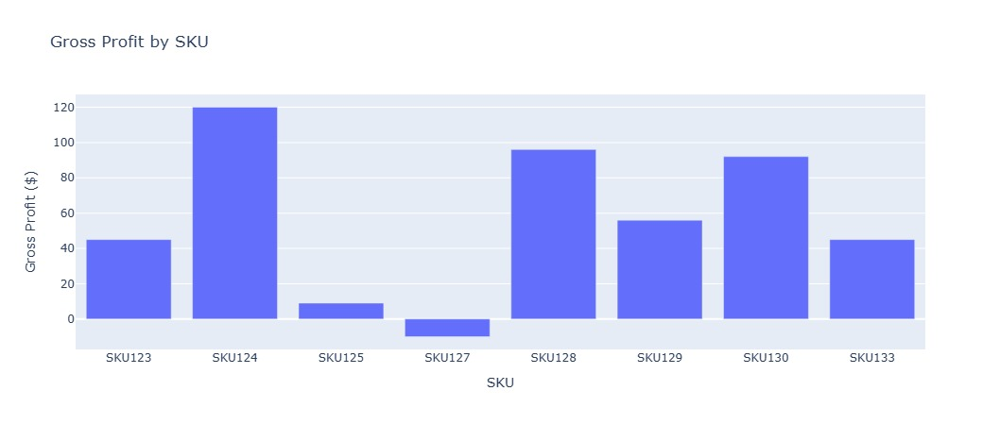
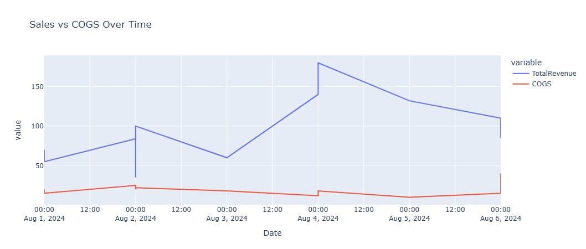

# SKU Profitability Analysis

## Objective 
This project analyzes profitability at the SKU level by integrating sales, cost of goods sold (COGS), and operational expense data. It aims to help e-commerce businesses identify top-performing products, improve pricing strategies, and make better financial decisions.

---

## Tools & Technologies Used

- *Python (Pandas, NumPy)* – Data manipulation
- *Matplotlib, Plotly* – Visualization
- *FPDF* – PDF report generation
- *Jupyter Notebook* – Interactive analysis

---

## Data Sources

The analysis combines three key datasets:

1. *Sales Data (Shopify-like)*  
   - SKU-level sales, dates, and revenue

2. *COGS Data (CIN7-like)*  
   - Unit cost per SKU

3. *Operational Expenses (QuickBooks-like)*  
   - Monthly recurring expenses

---

## Analysis Overview

- Merged sales with COGS and OPEX
- Calculated profit per SKU and per month
- Identified low-margin products
- Visualized performance trends
- Generated auto-report with insights

---

## Visualizations

🔹 Top 5 SKUs by Total Profit

---

🔹 Monthly Profit Trend

---

## PDF Report

A professional PDF report was auto-generated summarizing:

- Profit by SKU
- Gross Margin %
- Total Sales & Net Profit
- Low-margin product flags
- Monthly profit trend

---

## Key Business Insights

- *High-margin SKUs* contribute disproportionately to profit — focus marketing efforts here.
- *SKU002 & SKU005* showed poor profitability — may need price adjustments or discontinuation.
- *Profit fluctuates monthly*, signaling potential seasonality or inventory issues.
- Automated KPI summary helped *flag SKUs with <30% gross margin* for review.

---

## How This Helps Businesses

This analysis provides a *financially actionable view of SKU-level performance* by:

- Aligning cost, revenue, and expense data in one dashboard  
- Highlighting underperforming products early  
- Saving hours of manual data work through automation
- Supporting data-driven inventory and pricing decisions  
